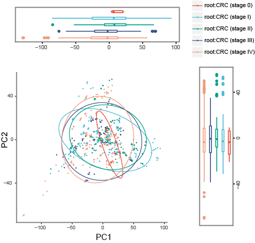

# UniPCoA
Unifrac-based PCoA visualization of microbial community samples.



Example input data can be found in `species_abundance.csv` and `metadata.csv`.

```bash
usage: UniPCoA.py [-h] [-i ABUNDANCE] [-m METADATA] [-o OUTPUT] [-t TREE] [--metric METRIC]

optional arguments:
  -h, --help            show this help message and exit
  -i ABUNDANCE, --abundance ABUNDANCE
                        The input abundance data, columns represent samples and rows represent taxa.
  -m METADATA, --metadata METADATA
                        The input metadata, use column "Env" to specify the group of the input samples.
  -o OUTPUT, --output OUTPUT
                        The folder to save output plots.
  -t TREE, --tree TREE  The input phylogenetic tree, in Newick format.
  --metric METRIC       The metric for beta_diversity calculation.
```

- PCoA analysis & visualization using `weighted_unifrac`  beta diversity.

```bash
python UniPCoA.py -i species_abundance.csv -m metadata.csv -t LTPs132_SSU_tree.newick --metric weighted_unifrac -o PCoA.Unifrac
```

- PCoA analysis & visualization using `jensenshannon`  beta diversity.

```bash
python UniPCoA.py -i species_abundance.csv -m metadata.csv --metric jensenshannon -o PCoA.JSD
```
